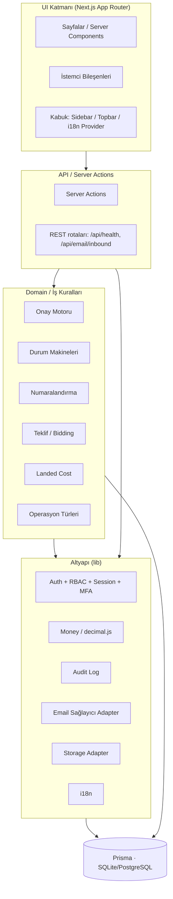
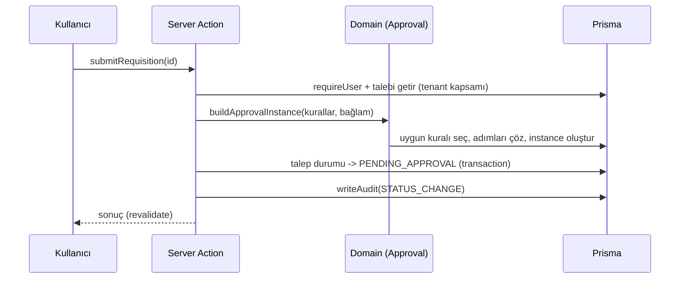

# Mimari

Coil Procurement Hub, ileride servislere ayrılabilecek temiz katman sınırlarına sahip bir **modüler monolit**tir.

## Katmanlar

## İlkeler

- **Yetki her zaman backend'de.** `requirePermission()` / `requireUser()` server action ve sayfalarda uygulanır; frontend kontrolüne asla güvenilmez.
- **Güvenli para.** Tüm parasal/miktar hesapları `src/lib/money.ts` (decimal.js) üzerinden; DB'de decimal-as-string.
- **Durum makineleri.** Geçersiz durum geçişleri `src/domain/state-machines.ts` ile backend'de engellenir.
- **Değişmez denetim.** `AuditLog` yalnızca eklenir (append-only); güncellenmez/silinmez.
- **Tenant izolasyonu.** Her sorgu `tenantId` ile kapsanır; kayıt bazlı kapsam (`UserScope`) ek kısıt sağlar.
- **Adapter tabanlı entegrasyon.** E-posta, depolama, kur, ERP, virüs tarama sağlayıcıları arayüz arkasında; mock/local mod her zaman çalışır.

## Modüller

Talep · RFQ · Teklif · Karşılaştırma/Karar · Sipariş · Lojistik/Mal Kabul · Kalite · Fatura/Eşleştirme · Tedarikçi · Sözleşme · Bütçe · Katalog · Raporlar · E-posta Merkezi · Entegrasyonlar · Denetim · Yönetim.

## İstek yaşam döngüsü (örnek: talebi onaya gönderme)

