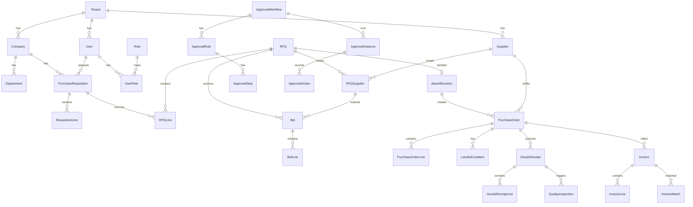

# ER Diyagramı (özet)

Tam şema: [`prisma/schema.prisma`](../prisma/schema.prisma) (70+ model). Aşağıda çekirdek akış varlıkları gösterilmiştir.

## Tasarım notları

- **Para/miktar** alanları `String` (decimal-as-string) — floating-point yok, `decimal.js` ile hesaplanır.
- **Enum** alanları `String` + `src/lib/enums.ts` / `src/domain/operations.ts` sabitleri (SQLite uyumu; PostgreSQL native enum'a taşınabilir).
- **Esnek/uzun kuyruk** veriler (ör. `PurchaseOrder.importInfo`, `ApprovalRule.conditions`) JSON metni.
- **Soft delete:** `Supplier.deletedAt`. Finansal/denetim kayıtları (Invoice, AuditLog) fiziksel silinmez.
- **Tenant izolasyonu:** ana varlıklarda `tenantId` + indeksler; benzersizlik kısıtları tenant kapsamında (`@@unique([tenantId, ...])`).
- **Mükerrer engeli:** `Invoice @@unique([tenantId, supplierId, number])`, tedarikçi `taxNumber`/`iban` indeksleri.
