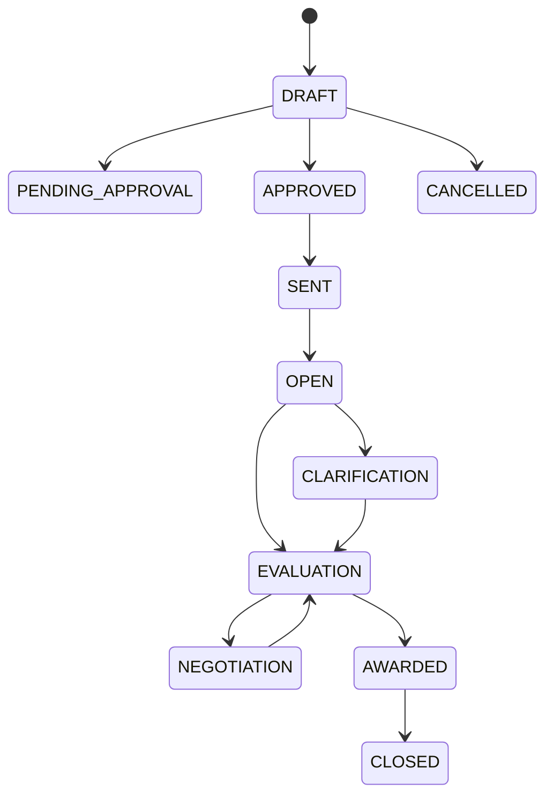

# Satınalma Süreç Akışı

```mermaid
flowchart LR
  A[Talep] --> B{Onaylar<br/>amir/teknik/bütçe/finans}
  B -->|Onay| C[Satınalmaya Atama]
  B -->|Ret| A
  C --> D[RFQ Oluştur]
  D --> E[Tedarikçilere Gönder<br/>magic-link + e-posta]
  E --> F[Tedarikçi Teklifleri]
  F --> G[Karşılaştırma / Bid Analysis]
  G --> H{Pazarlık / Revizyon?}
  H -->|Evet| E
  H -->|Hayır| I[Karar / Award<br/>split award]
  I --> J[Satınalma Siparişi]
  J --> K{Sipariş Onayı}
  K --> L[Tedarikçiye Gönder]
  L --> M[Sipariş Teyidi]
  M --> N[Sevkiyat / ASN]
  N --> O[Mal Kabul]
  O --> P[Kalite Kontrol]
  P --> Q[Fatura Üçlü Eşleştirme]
  Q --> R[Kapanış]
  R --> S[Tedarikçi Değerlendirmesi]
```

## Durum Makineleri

### Talep (Requisition)
`DRAFT → PENDING_APPROVAL → APPROVED → (ASSIGNED) → IN_RFQ → ORDERED → CLOSED` · `REJECTED` · `CANCELLED`

### RFQ

### Sipariş (Purchase Order)
`DRAFT → PENDING_APPROVAL → APPROVED → SENT → ACKNOWLEDGED → (PARTIALLY_)CONFIRMED → (PARTIALLY_)SHIPPED → (PARTIALLY_)RECEIVED → INVOICED → CLOSED` · `CANCELLED`

### Fatura
`DRAFT → MATCHING → MATCHED → APPROVED → PAID` · `BLOCKED` (tolerans dışı) · `CANCELLED`

> Geçersiz geçişler `src/domain/state-machines.ts` tarafından **backend'de** reddedilir.

## Onay kuralları (örnek — seed)

| Belge | Koşul | Adımlar |
|---|---|---|
| Talep | Tüm tutarlar | Departman Amiri → Satınalma Müdürü |
| Talep | ≥ 50.000 TL | Departman Amiri → Satınalma Müdürü → Finans |
| Sipariş | Tüm tutarlar | Satınalma Müdürü |
| Sipariş | ≥ 50.000 TL | Satınalma Müdürü → Finans/Yönetim |

Eşikler, koşullar (tutar, kategori, şirket, proje, **operasyon türü**, aciliyet, risk) ve adımlar `ApprovalWorkflow / ApprovalRule / ApprovalStep` üzerinden yönetim panelinden yapılandırılabilir. **Görevler ayrılığı**: kişi kendi oluşturduğu belgeyi onaylayamaz. **Vekâlet**: tarih aralığında onay yetkisi devredilebilir.
